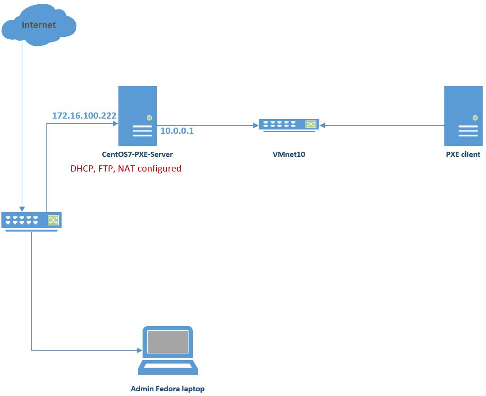
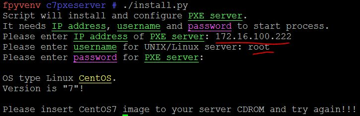
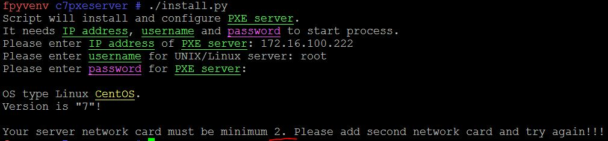
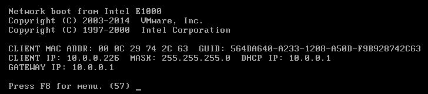
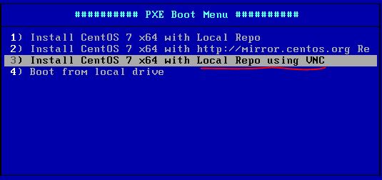
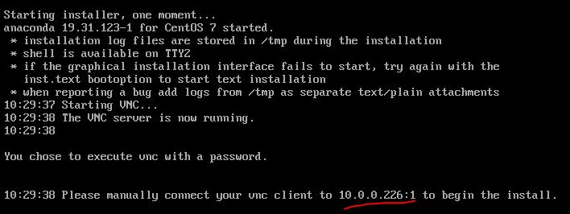
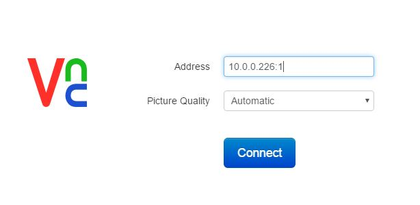
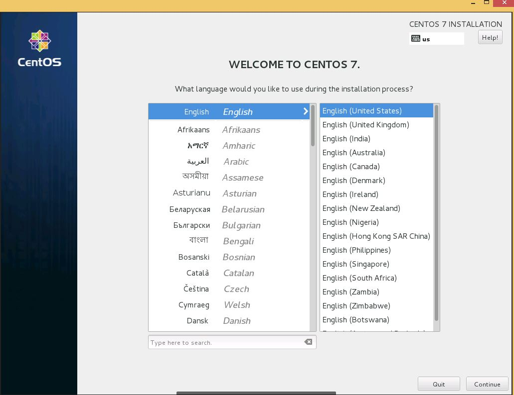

*****************
CentOS PXE Server
*****************

* In this artcile I will show how to install and configure PXE server in ``CentOS7`` with python script. Python script must be executed on Linux admin laptop and admin laptop must see server subnet. Script takes ``login``, ``password``, ``IP`` address of **CentOS7** server and then ``install/configure`` needed packages to the server. In the server, network card must be minimum ``2``, because with the internal network card it will share ``DHCP`` subnet and configure ``NAT`` with external IP to give access to the lan subnet. ``CDROM`` must be inserted with ``CentOS7`` image. If in the server will not be minimum **2** network card and CDROM will not be inserted(even cdrom will be mounted to the server before script execution) with CentOS7 image script give us notification about this. To install CentOS7 with **PXE**, client machine must be in the same subnet to see DHCP server. I used **vmnet10** in the virtual machines. To install CentOS7 via PXE there are will be **3** options. Install from repo server, install from internet and install with ``VNC``. To use VNC server we must write ``vnc password``. About vnc password script will ask you to write. 

* Our topology will be as following:

* Just try to execute script without CDROM inserted CentOS7 image:

* Try to install with 1 Network card:

* Try to normal installation process:
.. image:: images/normal-result.JPG

* At the end just try from client machine to boot from network with VNC:

* Connecto with VNC viewer to this IP address:

* At the end just connect to this IP with VNC viewer and use password which you typed in script execution time:

* To use this code use the following commands::

    [root@ ~]# git clone https://github.com/jamalshahverdiev/c7pxeserver.git
    [root@ ~]# cd c7pxeserver
    [root@ ~]# ./install.py
